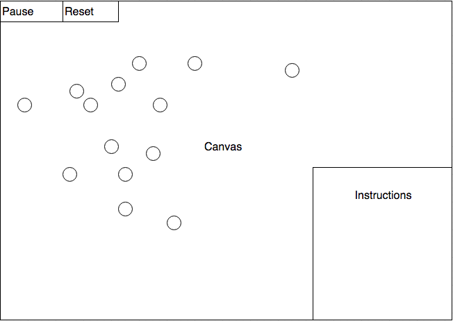

## JS Project Proposal: Cellular

### Background

Cellular is a collision based game that places the user in control of a singular cell at the atomic scale, placed amongst many other cells of varying sizes.  The goal in this minified universe essentially boils down to 2 things: survive and grow.  

To survive, the player must avoid colliding with any cells bigger than it.  To grow, the player must collide with ("eat") any cells that are smaller than it.  The player wins the round once their cell consumes everything in its path.

Further details are outlined in the **Functionality & MVP** and **Bonus Features** sections.  

### Functionality & MVP  

In Cellular, users will be able to:

- [ ] Start, pause, and reset the game board
- [ ] Control their cell and move it around the game board
- [ ] Grow from consuming smaller cells, die from hitting larger cells
- [ ] Win the round and initiate a new round upon clearing the board

In addition, this project will include:

- [ ] An About modal describing the background and rules of the game
- [ ] A production README

### Wireframes

This app will consist of a single screen with game board, game controls, and nav links to the Github, my LinkedIn,
and the About modal.  Game controls will include Pause and Reset buttons as well as a keystrokes to move your cell.

### Architecture and Technologies

This project will be implemented with the following technologies:

- Vanilla JavaScript and `jQuery` for overall structure and game logic,
- `Easel.js` with `HTML5 Canvas` for DOM manipulation and rendering,
- Webpack to bundle and serve up the various scripts.

In addition to the webpack entry file, there will be three scripts involved in this project:

`board.js`: this script will handle the logic for creating and updating the necessary `Easel.js` elements and rendering them to the DOM.

`game.js`: this script will handle the game loop logic.

`cell.js`: this lightweight script will house the constructor and update functions for the `Cell` objects.  Each `Cell` will contain a `type` (`human` or `cpu`) and a `size` (`true` or `false`).

### Implementation Timeline

**Day 1**: Setup all necessary Node modules, including getting webpack up and running and `Easel.js` installed.  Create `webpack.config.js` as well as `package.json`.  Write a basic entry file and the bare bones of all 3 scripts outlined above.  Learn the basics of `Easel.js`.  Goals for the day:

- Get a green bundle with `webpack`
- Learn enough `Easel.js` to render an object to the `Canvas` element

**Day 2**: Today's goal is to try to complete the game board and the basic cell logic.  By the end of day, you should have the board and various floating cells with their vector logic done and floating around the board.

**Day 3**: Today's goal is to allow user control over the human cell.  Once this is completed, we need to make sure that we have basic collision detection.  For now, make sure that the game loop stops on any collision.

**Day 4**: Today, we need to put in the finishing touches for the collision detection system.  The cell should now grow proportionally when it eats other cells and die on larger cell collisions.  Consider adding a score and the game over or next round logic.  

### Bonus features

There are many directions this cellular automata engine could eventually go.  Some anticipated updates are:

- [ ] Add nice looking graphics for a better user experience
- [ ] Implement multiplayer (competitive)
- [ ] Make different difficulties (enemy cells move faster, "chase" you)
